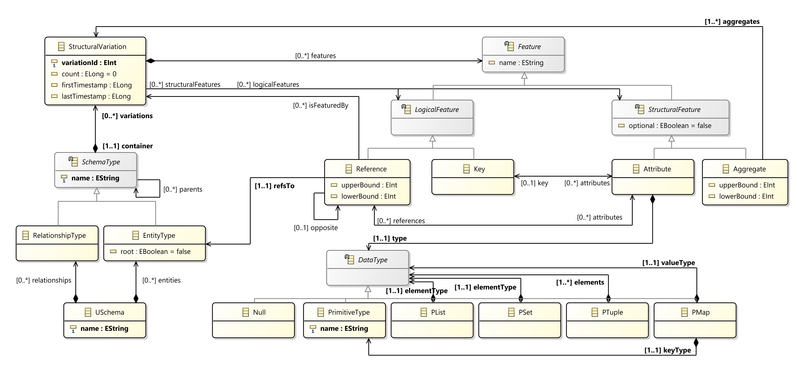

# The U-Schema metamodel

U-Schema is a unified logical model that integrates the concepts and rules of both the relational model and the four most common NoSQL data models: columnar, document, graph, and key–value.

<figure>
    
</figure>
 

The repository contains the following projects:

* `es.um.uschema`: The metamodel definition in an ecore file, and the generated java classes for this metamodel.
* `es.um.uschema.utils`: Utilities to handle U-Schema models easily, load and store models.
* `es.um.uschema.design`: A Sirius Viewpoint project to provide a visual representation of U-Schema models.

List of related publications:

* Carlos Javier Fernández Candel, Diego Sevilla Ruiz, Jesús García Molina, [A unified metamodel for NoSQL and relational databases](https://www.sciencedirect.com/science/article/pii/S0306437921001149). Information Systems 104: 101898.
