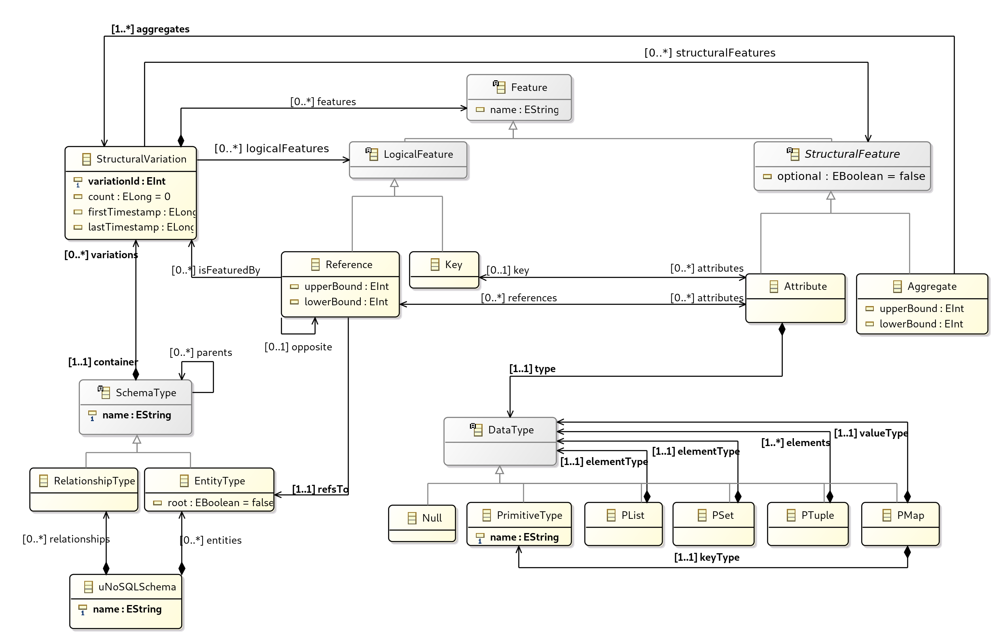

# The U-Schema metamodel

U-Schema is a unified logical model that integrates the concepts and rules of both the relational model and the four most common NoSQL data models: columnar, document, graph, and key–value.

<figure>
    
</figure>
 
